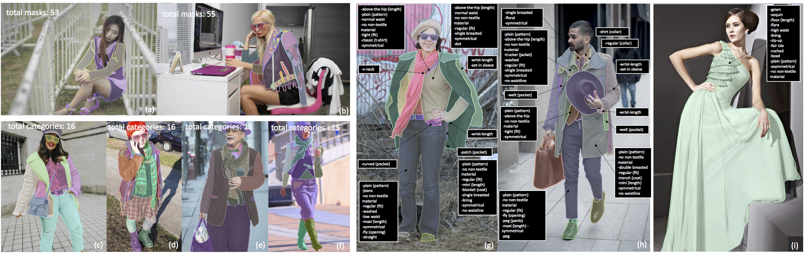
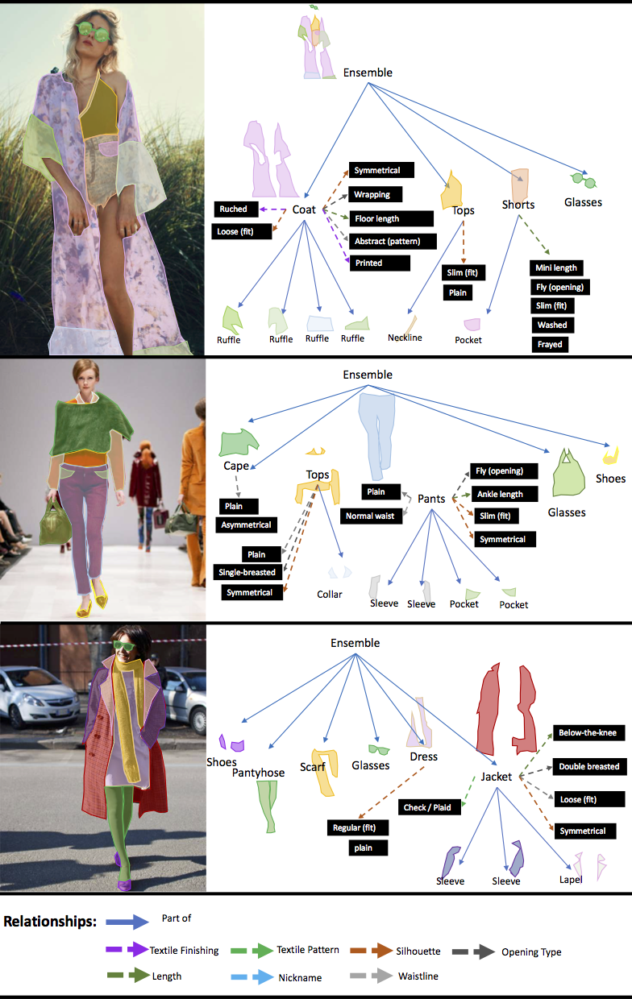

# Fashionpedia Annotation examples

Fashionpedia image examples with annotated segmentation masks (a-f) and fine-grained attributes (g-i).

Example images and annotations from our dataset: the images are annotated with both instance segmentation masks and fine-grained attributes (black boxes)

