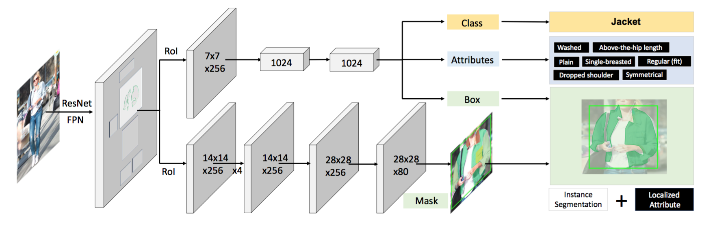

# Fashionpedia API

Fashionpedia is a new dataset which consists of two parts:  (1) an ontology built by fashion experts containing 27 main apparel categories, 19 apparel parts, 294 fine-grained attributes and their relationships; (2) a dataset with 48k everyday and celebrity event fashion images annotated with segmentation masks and their associated per-mask fine-grained attributes, built upon the Fashionpedia ontology.  

Check out our project page [here](https://fashionpedia.github.io/home/index.html) and download the data at this [link](https://github.com/cvdfoundation/fashionpedia).


<sub><strong>An illustration of the Fashionpedia dataset and ontology</strong>: (a) main garment masks; (b) garment part masks; (c) both main garment and garment part masks; (d) fine-grained apparel attributes; (e) an exploded view of the annotation diagram: the image is annotated with both instance segmentation masks <em>(white boxes)</em> and per-mask fine-grained attributes <em>(black boxes)</em>; (f) visualization of the Fashionpedia ontology: we created Fashionpedia ontology and separate the concept of categories <em>(yellow nodes)</em> and attributes  <em>(blue nodes)</em> in fashion. It covers pre-defined garment categories used by both Deepfashion2 and ModaNet. Mapping with DeepFashion2 also shows the versatility of using attributes and categories. We are able to present all 13 garment classes in DeepFashion2 with 11 main garment categories, 1 garment part, and 7 attributes.</sub>


With the introduction of the dataset, we explore the new task of *instance segmentation with attribute localization*. The proposed task requires both localizing an object and describing its properties, which unifies instance segmentation (detect and segment each object instance) and fine-grained visual attribute categorization (recognize one or multiple attributes). 

This Fashionpedia API enables reading, and visualizing annotations, and evaluating results. Check out our two demos for more details.


## [See more examples](<https://github.com/KMnP/fashionpedia-api/blob/master/DATA_EXAMPLES.md>)

## Setup

### via pip install

```bash
# create a new environment:
python3 -m venv env               # Create a virtual environment
source env/bin/activate           # Activate virtual environment

# step 1: install COCO API:
# Note: COCO API requires numpy to install. Ensure that you have numpy installed.
# e.g. pip install numpy
pip install 'git+https://github.com/cocodataset/cocoapi.git#subdirectory=PythonAPI'

# step 2: install Fashionpedia API via pip
pip install fashionpedia


# step 3: test. You can test that you have correctly installed the fashionpedia api
#       by running the following command inside the repo.
python test.py

# do your work ...

deactivate  # exit
```

### via git clone

Clone the repo first and then do the following steps inside the repo:

```bash
# create a new environment:
python3 -m venv env               # Create a virtual environment
source env/bin/activate           # Activate virtual environment

# step 1: install COCO API:
# Note: COCO API requires numpy to install. Ensure that you have numpy installed.
# e.g. pip install numpy
pip install 'git+https://github.com/cocodataset/cocoapi.git#subdirectory=PythonAPI'

# step 2: install required packages
pip install -r requirements.txt

# step 3: test. You can test that you have correctly installed the fashionpedia api
#       by running the following command inside the repo.
python test.py
# do your work here...

deactivate  # exit
```


## Evaluation

The evaluation code provide here can be used to measure results on the publicly available validation set. It computes multiple metrics describe below.  We consider both localization constraint (IoU) and attributes prediction constraint (F1 score) when computing $AP$ and $AR$. This is an extension of the [12 metrics](http://cocodataset.org/#detection-eval) of COCO detection evaluation.

```bash
Average Precision  (AP)
    AP@[ IoU=0.50:0.95 | F1=0.50:0.95 |area=all | maxDets=100]  # Primary metric
    AP@[ IoU=0.50      | F1=0.50:0.95 |area=all | maxDets=100]
    AP@[ IoU=0.75      | F1=0.50:0.95 |area=all | maxDets=100]
    AP@[ IoU=0.50:0.95 | F1=0.50      |area=all | maxDets=100]
    AP@[ IoU=0.50:0.95 | F1=0.75      |area=all | maxDets=100]
    AP@[ IoU=0.50      | F1=0.50      |area=all | maxDets=100]
    AP@[ IoU=0.50      | F1=0.75      |area=all | maxDets=100]
    AP@[ IoU=0.75      | F1=0.50      |area=all | maxDets=100]
    AP@[ IoU=0.75      | F1=0.75      |area=all | maxDets=100]
    AP@[ IoU=0.50:0.95 | F1=0.50:0.95 |area=  s | maxDets=100]
    AP@[ IoU=0.50:0.95 | F1=0.50:0.95 |area=  m | maxDets=100]
    AP@[ IoU=0.50:0.95 | F1=0.50:0.95 |area=  l | maxDets=100]

Average Recall     (AR)
    AR@[ IoU=0.50:0.95 | F1=0.50:0.95 |area=all | maxDets=  1]
    AR@[ IoU=0.50:0.95 | F1=0.50:0.95 |area=all | maxDets= 10]
    AR@[ IoU=0.50:0.95 | F1=0.50:0.95 |area=all | maxDets=100]
    AR@[ IoU=0.50:0.95 | F1=0.50:0.95 |area=  s | maxDets=100]
    AR@[ IoU=0.50:0.95 | F1=0.50:0.95 |area=  m | maxDets=100]
    AR@[ IoU=0.50:0.95 | F1=0.50:0.95 |area=  l | maxDets=100]
```


Additionally, we also provide metrics with only IoU constraint and only F1 thresholds constraint, for better understanding of the algorithm. See [evaluation demo](<https://github.com/KMnP/fashionpedia-api/blob/master/eval_demo.ipynb>)  for more details.


## Result format

The results format is similar to [COCO format for object detection](http://cocodataset.org/#format-results) with additional `attribute_ids` filed. See [evaluation demo](<https://github.com/KMnP/fashionpedia-api/blob/master/eval_demo.ipynb>) and also `loadRes()` in Fashionpedia API.

Detection with bounding boxes and localized attributes prediction:

```
[{
    "image_id": int, 
    "category_id": int, 
    "attribute_ids": [int],
    "bbox": [x,y,width,height], 
    "score": float,
}]
```

Detection with segmentation masks and localized attributes prediction:

```
[{
    "image_id": int, 
    "category_id": int, 
    "attribute_ids": [int],
    "segmentation": RLE,
    "score": float,
}]
```


## Attribute-Mask R-CNN Predictor Demo

For the task of instance segmentation with attribute localization, we present a strong baseline model named Attribute-Mask R-CNN that is built upon [Mask R-CNN](<https://arxiv.org/abs/1703.06870>) for Fashionpedia. Check out our [predictior demo](https://github.com/KMnP/fashionpedia-api/blob/master/baseline_predictor_demo.ipynb) and [paper](<https://arxiv.org/abs/2004.12276>) for more details. 




### Pretrained Models  

The 1). *pretrained model ckpts* and 2). *training code* including data conversion, model training and inference [here](<https://github.com/tensorflow/tpu/tree/master/models/official/detection/projects/fashionpedia>).


## Citing Fashionpedia

```bash
@inproceedings{jia2020fashionpedia,
  title={Fashionpedia: Ontology, Segmentation, and an Attribute Localization Dataset},
  author={Jia, Menglin and Shi, Mengyun and Sirotenko, Mikhail and Cui, Yin and Cardie, Claire and Hariharan, Bharath and Adam, Hartwig and Belongie, Serge}
  booktitle={European Conference on Computer Vision (ECCV)},
  year={2020}
}
```


## Credit

Both fashionpedia and fashionpediaEval are sub-classes of COCO and COCOeval from PythonAPI for [COCO](https://github.com/cocodataset/cocoapi).    [LVIS-API](<https://github.com/lvis-dataset/lvis-api>) was also referenced during the development.