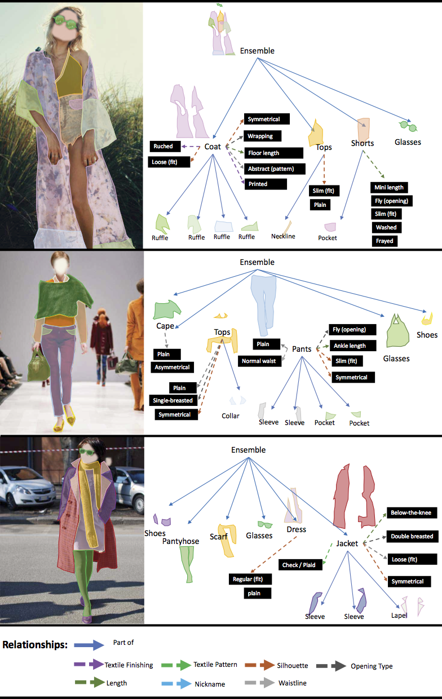

# Fashionpedia API

Fashionpedia is a new dataset which consists of two parts:  (1) an ontology built by fashion experts containing 27 main apparel categories, 19 apparel parts, 294 fine-grained attributes and their relationships; (2) a dataset with everyday and celebrity event fashion images annotated with segmentation masks and their associated per-mask fine-grained attributes, built upon the Fashionpedia ontology. 


<sub><strong>An illustration of the Fashionpedia dataset and ontology</strong>: (a) main garment masks; (b) garment part masks; (c) both main garment and garment part masks; (d) fine-grained apparel attributes; (e) an exploded view of the annotation diagram: the image is annotated with both instance segmentation masks <em>(white boxes)</em> and per-mask fine-grained attributes <em>(black boxes)</em>; (f) visualization of the Fashionpedia ontology: we created Fashionpedia ontology and separate the concept of categories <em>(yellow nodes)</em> and attributes  <em>(blue nodes)</em> in fashion. It covers pre-defined garment categories used by both Deepfashion2 and ModaNet. Mapping with DeepFashion2 also shows the versatility of using attributes and categories. We are able to present all 13 garment classes in DeepFashion2 with 11 main garment categories, 1 garment part, and 7 attributes.</sub>


With the introduction of the dataset, we explore the new task of *instance segmentation with attribute localization*. The proposed task requires both localizing an object and describing its properties, which unifies instance segmentation (detect and segment each object instance) and fine-grained visual attribute categorization (recognize one or multiple attributes). 

This Fashionpedia API enables reading, and visualizing annotations, and evaluating results. Check out our two demos for more details.


## More dataset examples


<sub>Fashionpedia image examples with annotated segmentation masks (a-f) and fine-grained attributes (g-i).</sub>




<sub>Example images and annotations from our dataset: the images are annotated with both instance segmentation masks and fine-grained attributes (black boxes)</sub>


## Setup

Clone the repo first and then do the following steps inside the repo:

```bash
# create a new environment:
python3 -m venv env               # Create a virtual environment
source env/bin/activate           # Activate virtual environment

# install COCO API. COCO API requires numpy to install. Ensure that you installed numpy.
pip install 'git+https://github.com/cocodataset/cocoapi.git#subdirectory=PythonAPI'
# install Fashionpedia API
pip install -r requirements.txt

# test:
python test.py

# exit
deactivate
```


## Citing Fashionpedia

```
@article{jia2020fashionpedia,
    title={Fashionpedia: Ontology, Segmentation, and an Attribute Localization Dataset},
    author={Jia, Menglin and Shi, Mengyun and Sirotenko, Mikhail and Cui, Yin and Cardie, Claire and Hariharan, Bharath and Adam, Hartwig and Belongie, Serge},
    journal={arXiv preprint arXiv:2004.12276},
    year={2020}
}
```


## Credit

Both fashionpedia and fashionpediaEval are sub-classes of COCO and COCOeval from PythonAPI for [COCO](https://github.com/cocodataset/cocoapi). 